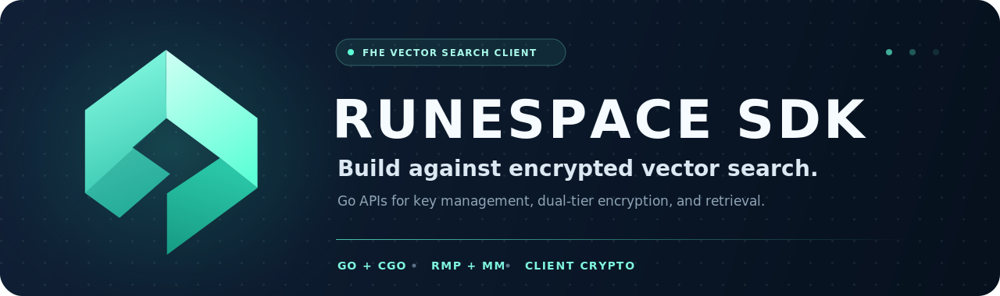

<p align="center">
  <a href="https://rune.team" aria-label="RUNE website">
    
  </a>
</p>

<p align="center">
  
</p>

<p align="center">
  <a href="https://rune.team">rune.team</a> ·
  <a href="https://pkg.go.dev/github.com/CryptoLabInc/runespace-sdk">Go API</a> ·
  <a href="https://github.com/CryptoLabInc/runespace-sdk/releases">Releases</a>
</p>

RuneSpace SDK is the Go client for the RuneSpace encrypted vector index. It manages the client side of the RNS-CKKS contract: key generation, local item encryption, public evaluation-key registration, dual-tier inserts, search-result decryption, metadata resolution, and ranking.

> [!CAUTION]
> This repository is proprietary software. Access to the source or its public visibility does not grant permission to use, modify, redistribute, or deploy it. Obtain written authorization from CryptoLab before integrating the SDK; see [License](#license).

## Security boundary

The current data path has several distinct privacy properties:

| Data | Current handling |
| --- | --- |
| Stored vector | L2-normalized and FHE-encrypted locally before `Insert`. |
| Evaluation keys | Public key material streamed to RuneSpace for encrypted computation. |
| Secret keys | Remain with the SDK key holder and are required to decrypt results. |
| Search query vector | Under the current PCMM contract, sent plaintext to RuneSpace and encoded server-side. |
| `metadata` argument | Stored as plaintext JSON by RuneSpace. Seal sensitive metadata before calling this SDK. |
| Search scores | Returned encrypted and decrypted by the SDK before ranking. |

RuneSpace never needs the FHE secret key, but the current API does **not** hide query vectors or SDK metadata from the RuneSpace service. Deploy the service inside the trust boundary appropriate for that contract.

## Requirements

The SDK binds bundled `libevi` archives through cgo.

- Go 1.26.4 or newer
- A C/C++ toolchain
- OpenSSL 3 development headers and libraries
- A supported bundled libevi target:
  - `darwin/arm64`
  - `linux/amd64`
  - `linux/arm64`
  - `windows/amd64`

| Platform | Prerequisites |
| --- | --- |
| macOS Apple Silicon | `xcode-select --install` and `brew install openssl@3` |
| Debian / Ubuntu | `apt install build-essential libssl-dev` |
| RHEL / Fedora | `dnf install gcc-c++ make openssl-devel` |
| Alpine | `apk add build-base openssl-dev` |
| Windows | MSYS2 mingw64 with GCC and OpenSSL packages |

Cross-compilation needs the target C toolchain and sysroot; setting only `GOOS` and `GOARCH` is insufficient.

## Authorized installation

There is no unrestricted public installation grant. After your organization has an agreement and repository access, use the approved version supplied by CryptoLab rather than an unqualified latest dependency:

```bash
GOPRIVATE=github.com/CryptoLabInc/runespace-sdk \
  go get github.com/CryptoLabInc/runespace-sdk@<approved-version>
```

Do not vendor, mirror, redistribute, or deploy the module outside the scope of that agreement.

## Quick start

This example matches the current API: `Insert` creates and returns the item ID, and search hits expose `ClusterID` and `Row` rather than a `Slot` field.

```go
package main

import (
	"context"
	"fmt"
	"log"
	"time"

	runespace "github.com/CryptoLabInc/runespace-sdk"
)

func main() {
	keyOpts := []runespace.KeysOption{
		runespace.WithKeyPath("./team-a-keys"),
		runespace.WithKeyID("team-a"),
		runespace.WithKeyDim(128),
	}
	if !runespace.KeysExist(keyOpts...) {
		if err := runespace.GenerateKeys(keyOpts...); err != nil {
			log.Fatal(err)
		}
	}

	keys, err := runespace.OpenKeys(keyOpts...)
	if err != nil {
		log.Fatal(err)
	}
	defer keys.Close()

	client, err := runespace.Dial(
		"runespace.example:51024",
		runespace.WithAccessToken("<access-token>"),
	)
	if err != nil {
		log.Fatal(err)
	}
	defer client.Close()

	ctx, cancel := context.WithTimeout(context.Background(), 10*time.Minute)
	defer cancel()

	if err := client.RegisterKeys(ctx, keys); err != nil {
		log.Fatal(err)
	}

	embedding := make([]float32, 128)
	embedding[0] = 1 // replace with a real embedding of the configured dimension

	id, err := client.Insert(
		ctx,
		embedding,
		`{"title":"hello"}`,
		runespace.WithFilterTags("team:platform"),
	)
	if err != nil {
		log.Fatal(err)
	}
	fmt.Println("inserted", id)

	hits, err := client.Search(
		ctx,
		embedding,
		5,
		runespace.WithScope("team:platform"),
	)
	if err != nil {
		log.Fatal(err)
	}
	for _, hit := range hits {
		fmt.Printf("id=%s cluster=%d row=%d score=%.4f metadata=%s\n",
			hit.ID, hit.ClusterID, hit.Row, hit.Score, hit.Metadata)
	}
}
```

Production connections use TLS and the system certificate pool by default. `WithInsecure()` exists only for explicitly trusted local development endpoints.

## Dual-tier data path

The RMP and MM paths are both implemented and required by the current insert contract:

1. `RegisterKeys` streams the public RMP and MM evaluation keys.
2. `Insert` normalizes the item vector and creates both flat RMP and clustered MM ciphertexts.
3. The SDK fetches the server's centroid set and routes the MM item to one cluster.
4. `Search` always scans the flat tier and also probes clustered cells when the centroid set is enabled.
5. The SDK decrypts both score sets, removes dead rows, merges and deduplicates hits, resolves IDs and metadata, and returns the top results.

An insert without a usable centroid set fails with `ErrClusterRequired`. The MM path is not a reserved future feature.

## Key durability and backup

> [!WARNING]
> Losing the `SecKey` files permanently destroys the ability to decrypt existing search results. Generating a new key set does not recover old data, and the current service does not provide transparent key rotation.

`GenerateKeys` creates one identity across two directories:

```text
team-a-keys/
├── rmp/   # EncKey, EvalKey, SecKey for the flat tier
└── mm/    # EncKey, EvalKey, SecKey for the clustered tier
```

Back up the **entire key root**, not individual files:

1. Wait for `GenerateKeys` to finish and stop processes that may replace or copy the directory.
2. Take one atomic snapshot of both `rmp/` and `mm/` with file ownership and permissions preserved.
3. Encrypt the backup with your organization's KMS, HSM, or offline backup key before it leaves the host.
4. Store at least one copy outside the failure domain of the RuneSpace client and Console.
5. Regularly restore into an isolated path, call `OpenKeys`, and use `Client.VerifyKeys` to confirm it matches the registered evaluation-key fingerprints.

For example, teams that use `age` can stream an archive directly into encrypted storage without leaving an unencrypted tarball:

```bash
umask 077
tar -C /srv/runespace -czf - team-a-keys \
  | age -r 'age1replace-with-your-offline-recipient' \
  > /secure-backup/team-a-keys.tar.gz.age
```

Treat encryption keys, backup recipients, checksums, retention, restore authorization, and audit logging as production secrets-management concerns. Never commit key material or backups to this repository.

## Key loading roles

`OpenKeys` loads encryption and decryption material by default. Limit a process to the parts it needs:

| Role | Parts | Available operations |
| --- | --- | --- |
| Capture client | `KeyPartEnc` | Local RMP/MM item encryption and `Insert`. |
| Rune Console | `KeyPartSec` | RMP/MM score decryption. |
| Full client | Omit `WithKeyParts` | Encryption, registration from disk, and decryption. |

Evaluation keys are streamed from disk by `RegisterKeys`; `KeyPartEval` remains for source compatibility but does not keep the large evaluation keys resident in memory.

## Common API

| API | Purpose |
| --- | --- |
| `GenerateKeys` / `OpenKeys` | Create and open the paired RMP/MM key set. |
| `RegisterKeys` / `VerifyKeys` | Register public evaluation keys and verify their identity. |
| `Insert` / `InsertPreEncrypted` | Append a locally encrypted item or forward ciphertext produced elsewhere. |
| `Search` | Search both tiers, decrypt scores, resolve metadata, and rank hits. |
| `Delete` | Tombstone an item by ID. |
| `UpdateTags`, `RetagAll`, `RemoveTag` | Maintain plaintext filter-tag scopes. |
| `Info` | Inspect engine health, build identity, and registered-key metadata. |

Filter tags and scopes are trusted plaintext labels. The server does not authenticate their provenance; only a trusted policy layer should construct them.

## Examples

Runnable programs live under [`examples/`](examples/):

| Example | Flow |
| --- | --- |
| [`examples/quickstart`](examples/quickstart/) | Key generation, registration, insert, and search. |
| [`examples/filtertags`](examples/filtertags/) | Scoped inserts and tag mutation. |

```bash
RUNESPACE_ADDR=127.0.0.1:51024 \
RUNESPACE_DIM=128 \
RUNESPACE_KEYS=./rs-keys \
go run ./examples/quickstart
```

The crash, recovery, and rebalance end-to-end suite lives with the RuneSpace engine rather than in this repository.

## Building from source

Authorized source checkouts include the platform-specific libevi archives and generated protobuf stubs.

```bash
make build
make test
make vet
```

See [`third_party/evi/PROVENANCE`](third_party/evi/PROVENANCE) and [`pkg/runespacepb/PROVENANCE`](pkg/runespacepb/PROVENANCE) for pinned native-library and protocol provenance.

## License

Copyright © 2026 CryptoLab Inc. All rights reserved. This software is proprietary and confidential; use, modification, redistribution, cloud deployment, and commercial use require explicit written permission. Read the complete [LICENSE](LICENSE) before obtaining or using the software.

Licensing inquiries: `pypi@cryptolab.co.kr`

<p align="center">
  Part of <a href="https://rune.team">RUNE</a> · Built by <a href="https://www.cryptolab.co.kr/">CryptoLab</a>
</p>
